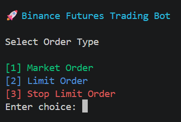

# 🚀 Binance Futures Testnet Trading Bot

<div align="center">

**A clean, modular Python trading bot for Binance Futures Testnet with Market, Limit, and Stop-Limit order support, validation, logging, and interactive CLI experience.**

</div>

---

# 📚 References

## Binance Futures Testnet

This project uses Binance USDT-M Futures Testnet for order execution and testing.

### Official Documentation

- Binance Derivatives API Documentation:
  https://developers.binance.com/docs/derivatives/Introduction

- Binance Futures Testnet:
  https://testnet.binancefuture.com

### API Endpoints Used

- New Order (Market / Limit)
- Conditional Order (Stop-Limit)
- Futures Account Authentication
- Exchange Information

The application uses the official Binance Futures API through the python-binance library while targeting the Binance Futures Testnet environment.

---

# ✨ Features

## Core Requirements

### 📈 Market Orders

Place instant BUY or SELL market orders.

### 🎯 Limit Orders

Place BUY or SELL limit orders at a specified price.

### 🔄 Futures Trading Support

Supports Binance USDT-M Futures Testnet.

### 🛡 Input Validation

Validates:

* Symbol format
* Order side
* Quantity
* Price
* Order type

### 📋 Order Summary

Displays:

* Symbol
* Side
* Order Type
* Quantity
* Price (if applicable)

### 📝 Structured Logging

Logs:

* API responses
* Validation failures
* Network errors
* Binance API exceptions

### ⚠ Error Handling

Handles:

* Invalid inputs
* Network issues
* Binance API errors
* Missing parameters

---

## 🌟 Bonus Features Implemented

### Stop-Limit Orders

Supports Binance Futures Stop-Limit orders.

Example:

* Stop Price: 63000
* Limit Price: 62950

Order activates when stop price is reached.

---

### Enhanced CLI Experience

Interactive menu-driven workflow:

```text
Select Order Type

1. Market Order
2. Limit Order
3. Stop-Limit Order
```

Prompts users for required fields dynamically.

---

# 🎥 Demo

## Main Menu



## Market Order


## Limit Order


## Stop-Limit Order


---

# 🏗 Project Structure

```text
trading_bot/
│
├── bot/
│   ├── __init__.py
│   ├── client.py
│   ├── orders.py
│   ├── validators.py
│   ├── logging_config.py
│   ├── utils.py
│
├── logs/
│   └── trading.log
│
├── .env
├── cli.py
├── requirements.txt
├── README.md
└── .gitignore
```

---

# 🧩 Architecture

```text
User
 │
 ▼
CLI (Typer)
 │
 ▼
Validators
 │
 ▼
Order Service
 │
 ▼
Binance Client Wrapper
 │
 ▼
Binance Futures Testnet API
 │
 ▼
Response + Logging
```

---

# ⚙️ Technology Stack

| Component             | Technology              |
| --------------------- | ----------------------- |
| Language              | Python 3                |
| CLI                   | Typer                   |
| Exchange API          | python-binance          |
| Environment Variables | python-dotenv           |
| Logging               | logging module          |
| Futures Exchange      | Binance Futures Testnet |

---

# 📦 Installation

## 1️⃣ Clone Repository

```bash
git clone https://github.com/Ujjwal-Modi/Trading-Bot-Binance-Futures-Testnet-.git

cd Trading-Bot-Binance-Futures-Testnet-
```

---

## 2️⃣ Create Virtual Environment

### Windows

```bash
python -m venv venv

venv\Scripts\activate
```

### Linux / Mac

```bash
python3 -m venv venv

source venv/bin/activate
```

---

## 3️⃣ Install Dependencies

```bash
pip install -r requirements.txt
```

---

## 4️⃣ Create Binance Futures Testnet Account

Create an account at:

[https://testnet.binancefuture.com](https://testnet.binancefuture.com)

Generate:

* API Key
* Secret Key

---

## 5️⃣ Configure Environment Variables

Create a `.env` file:

```env
BINANCE_API_KEY=your_api_key

BINANCE_API_SECRET=your_secret_key
```

---

# ▶ Running the Application

```bash
python cli.py menu
```

Interactive menu will appear.

```text
================================
 Binance Futures Trading Bot
================================

Select Order Type

1. Market Order
2. Limit Order
3. Stop-Limit Order

```

---

# 📈 Market Order Example

### Buy BTC

```bash
python cli.py trade BTCUSDT BUY MARKET 0.001
```

Example Output:

```text
✅ SUCCESS

Order ID: 12345678
Status: FILLED
Symbol: BTCUSDT
Side: BUY
Type: MARKET
Quantity: 0.001
Executed Qty: 0.001
Avg Price: 63540.40
```

---

# 📉 Market Sell Example

```bash
python cli.py trade BTCUSDT SELL MARKET 0.001
```

---

# 🎯 Limit Order Example

Buy BTC at a specific price:

```bash
python cli.py trade BTCUSDT BUY LIMIT 0.001 --price 60000
```

Example Output:

```text
✅ SUCCESS

Order ID: 12345679
Status: NEW
Symbol: BTCUSDT
Side: BUY
Type: LIMIT
Quantity: 0.001
Price: 60000
```

---

# 🎯 Limit Sell Example

```bash
python cli.py trade BTCUSDT SELL LIMIT 0.001 --price 70000
```

---

# 🛑 Stop-Limit Order Example

### Stop-Limit Sell

Current BTC Price:

```text
63540
```

Protect downside:

```bash
python cli.py trade BTCUSDT SELL STOP_LIMIT 0.001 --stop-price 63000 --price 62950
```

Meaning:

* Trigger when price reaches 63000
* Place limit order at 62950

---

### Stop-Limit Buy

```bash
python cli.py trade BTCUSDT BUY STOP_LIMIT 0.001 --stop-price 65000 --price 65100
```

Meaning:

* Trigger at 65000
* Place limit order at 65100

---

# 📄 Logging

Logs are stored in:

```text
logs/trading.log
```

Example:

```text
2026-06-12 04:51:20,146 - INFO - Market order success:
{
  "orderId": 14937373431,
  "symbol": "BTCUSDT",
  "status": "NEW",
  "side": "BUY",
  "type": "MARKET"
}
```

> **Note:** Log output has been shortened for readability. The actual log file contains the full Binance API response.

---

# 🛡 Validation Rules

## Symbol

✔ Must not be empty

Example:

```text
BTCUSDT
ETHUSDT
```

---

## Side

Allowed:

```text
BUY
SELL
```

---

## Order Type

Allowed:

```text
MARKET
LIMIT
STOP_LIMIT
```

---

## Quantity

Must be:

```text
> 0
```

---

## Price

Required for:

```text
LIMIT
STOP_LIMIT
```

---

## Stop Price

Required for:

```text
STOP_LIMIT
```

---

# ⚠ Common Binance Errors

## -2021

```text
Order would immediately trigger.
```

Cause:

For Stop-Limit orders, stop price must be logically placed relative to current market price.

Example:

Current BTC Price:

```text
63540
```

Invalid:

```text
SELL Stop Price = 70000
```

because it would trigger instantly.

---

Valid Example:

```text
SELL Stop Price = 63000
```

---

# 🧪 Sample Test Cases

### Market Buy

```bash
python cli.py trade BTCUSDT BUY MARKET 0.001
```

Expected:

```text
FILLED
```

---

### Limit Buy

```bash
python cli.py trade BTCUSDT BUY LIMIT 0.001 --price 50000
```

Expected:

```text
NEW
```

---

### Stop-Limit Sell

```bash
python cli.py trade BTCUSDT SELL STOP_LIMIT 0.001 --stop-price 63000 --price 62950
```

Expected:

```text
NEW
```

---

# 🔐 Security Notes

* Never commit `.env`
* Never expose API keys
* Testnet credentials only
* Use `.gitignore`

Example:

```gitignore
.env
venv/
__pycache__/
logs/
```

---

# 📝 Assumptions

1. User has an active Binance Futures Testnet account.
2. API credentials are valid.
3. Internet connection is available.
4. Trading occurs only on Binance Futures Testnet.
5. User has sufficient testnet balance.
6. Symbols used are supported by Binance Futures.
7. Quantity satisfies Binance lot-size requirements.

---

# 🎯 Evaluation Criteria Coverage

| Requirement      | Status       |
| ---------------- | ------------ |
| Market Orders    | ✅            |
| Limit Orders     | ✅            |
| BUY/SELL Support | ✅            |
| CLI Input        | ✅            |
| Validation       | ✅            |
| Logging          | ✅            |
| Error Handling   | ✅            |
| Clean Structure  | ✅            |
| README           | ✅            |
| Bonus Feature    | ✅ Stop-Limit |
| Enhanced UX      | ✅            |

---

# 🔮 Future Enhancements

- Position Management
- Order History
- Cancel Orders
- Modify Orders
- Streamlit Dashboard
- Real-Time Price Feed via WebSockets
- Take Profit Orders
- Trailing Stop Orders
- Portfolio Analytics

---

# 👨‍💻 Author

**Ujjwal Modi**

🎓 B.Tech Computer Science Engineering
🏆 CodeChef 2★ Programmer
🤖 AI / Full Stack Developer
📈 Trading Bot Developer

### Connect

* GitHub: [https://github.com/Ujjwal-Modi](https://github.com/Ujjwal-Modi)
* LinkedIn: [https://www.linkedin.com/in/ujjawalmodi/](https://www.linkedin.com/in/ujjawalmodi/)

---

<div align="center">

### ⭐ If you found this project useful, consider giving it a star!

🚀 Happy Trading on Binance Futures Testnet 🚀

</div>
